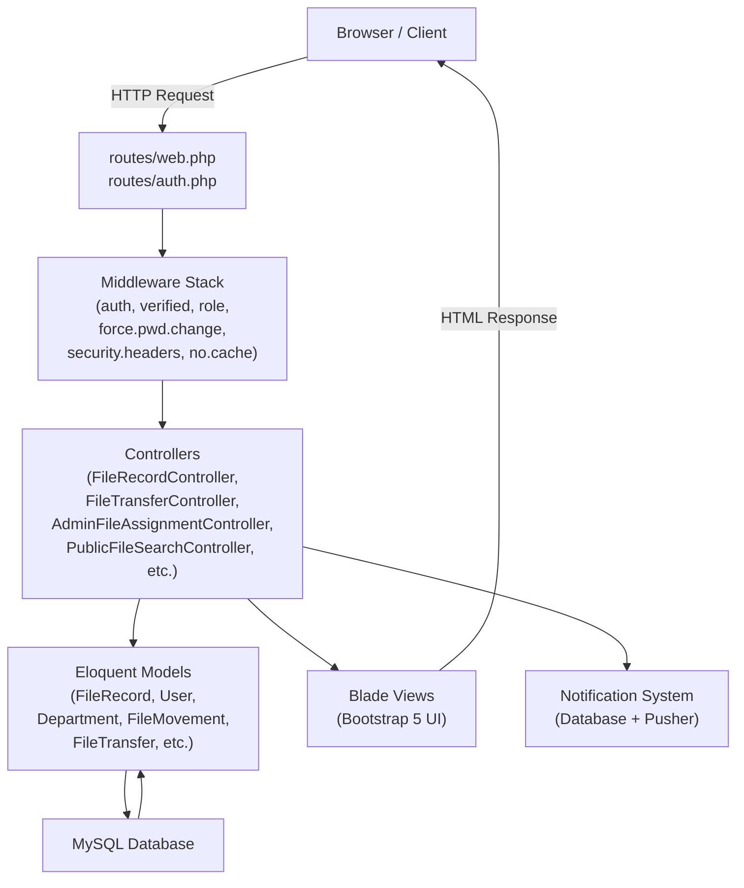

# INDUSTRIAL TRAINING REPORT

---

## COVER PAGE

**Title of Project:**
File Tracking System

**Submitted by:**
[Student Name]
B.Sc. Computer Science — [Semester / Year]
Roll No: [Roll Number]
[College / University Name]

**Organization:**
Department of Information Technology (DIT)
Government of Sikkim

**Training Period:**
1 June 2026 – 15 July 2026

**Submitted to:**
[Department of Computer Science]
[College / University Name]

**Academic Year:**
2025 – 2026

---

## CERTIFICATE

*[Placeholder — To be signed and issued by the supervising officer at the Department of Information Technology, Government of Sikkim]*

This is to certify that **[Student Name]**, Roll No. **[Roll Number]**, a student of **B.Sc. Computer Science** at **[College / University Name]**, has successfully completed the Industrial Training at the **Department of Information Technology (DIT), Government of Sikkim**, from **1 June 2026 to 15 July 2026**.

During the training period, the student actively participated in the development of the **File Tracking System**, a web-based application for tracking government files across departments. The work was carried out satisfactorily and in a professional manner.

**Signature of Supervising Officer:**
Name:
Designation:
Organization: Department of Information Technology, Government of Sikkim
Date:

**Seal of Organization:**

---


## ABSTRACT

The File Tracking System is a web-based application developed during an industrial training at the Department of Information Technology (DIT), Government of Sikkim, from 1 June 2026 to 15 July 2026. The system was built to address the challenge of tracking official government files as they move across departments, users, and offices. Before this system, file tracking was largely manual, resulting in misplaced files, delays in processing, and lack of transparency.

The application was developed using Laravel 12, PHP 8.2, MySQL, Bootstrap 5, and JavaScript, following the Model-View-Controller (MVC) architectural pattern. The system supports three user roles — Super Admin, Department Admin, and User — each with clearly defined permissions. Key features include file creation with department-scoped unique file numbers, real-time file transfer between users and departments, a department assignment queue for incoming files, a public file search portal, a complete file journey timeline, and a database notification system.

Security was given high priority. The system implements role-based access control, email verification, a forced password change on first login, session-based impersonation for administrative oversight, and HTTP security headers including Content Security Policy and X-Frame-Options. All primary records use UUID-based routing to prevent enumeration attacks.

This report documents the technologies used, the system architecture, the database design, the implementation of each module, the challenges encountered during development, and the solutions applied. The report concludes with recommendations for future enhancements.

---

## ACKNOWLEDGEMENT

I would like to express my sincere gratitude to the **Department of Information Technology (DIT), Government of Sikkim**, for providing this valuable industrial training opportunity. The experience gained during the six-week training period has been instrumental in building my practical understanding of web application development in a real-world government environment.

I am deeply thankful to my supervising officer and the technical team at DIT for their constant guidance, mentorship, and constructive feedback throughout the development of the File Tracking System.

I also extend my gratitude to the faculty of the **Department of Computer Science, [College / University Name]**, for their academic support and for encouraging industry engagement as part of the curriculum.

Finally, I thank my family and friends for their support and encouragement during this period.

---


## TABLE OF CONTENTS

| Section | Title | Page |
|---------|-------|------|
| | Cover Page | i |
| | Certificate | ii |
| | Abstract | iii |
| | Acknowledgement | iv |
| | Table of Contents | v |
| | List of Figures | vi |
| | List of Tables | vii |
| | List of Abbreviations | viii |
| **Chapter 1** | **Introduction** | |
| 1.1 | Overview of Industrial Training | |
| 1.2 | Objectives of Training | |
| 1.3 | Organization Profile | |
| 1.4 | Scope of Training | |
| **Chapter 2** | **Technologies and Tools Used** | |
| 2.1 | Laravel Framework | |
| 2.2 | PHP | |
| 2.3 | MySQL | |
| 2.4 | HTML, CSS, JavaScript, and Bootstrap 5 | |
| 2.5 | Git and GitHub | |
| **Chapter 3** | **File Tracking System Development** | |
| 3.1 | Problem Statement | |
| 3.2 | System Objectives | |
| 3.3 | System Architecture | |
| 3.4 | Database Design | |
| 3.5 | System Modules | |
| 3.6 | User Roles and Permissions | |
| 3.7 | File Transfer Workflow | |
| 3.8 | Notification System | |
| 3.9 | Public File Search | |
| 3.10 | File Journey Timeline | |
| **Chapter 4** | **Challenges and Solutions** | |
| 4.1 | Database Migration Issues | |
| 4.2 | Authentication and Authorization | |
| 4.3 | Performance Optimization | |
| 4.4 | UI/UX Improvements | |
| **Chapter 5** | **Conclusion and Future Scope** | |
| 5.1 | Conclusion | |
| 5.2 | Future Scope | |
| | References | |

---

## LIST OF FIGURES

| Figure No. | Title |
|------------|-------|
| Figure 3.1 | Landing Page |
| Figure 3.2 | Login Page |
| Figure 3.3 | Forgot Password Page |
| Figure 3.4 | Super Admin Dashboard |
| Figure 3.5 | Department Admin Dashboard |
| Figure 3.6 | User Dashboard |
| Figure 3.7 | Department Management |
| Figure 3.8 | Designation Management |
| Figure 3.9 | User Management |
| Figure 3.10 | Create User Form |
| Figure 3.11 | Create File Form |
| Figure 3.12 | File Details Page |
| Figure 3.13 | File Transfer Page |
| Figure 3.14 | Transfer Approval |
| Figure 3.15 | Pending Assignment Queue |
| Figure 3.16 | Notification Dropdown |
| Figure 3.17 | Public File Search |
| Figure 3.18 | Public Search Result |
| Figure 3.19 | File Journey Timeline |
| Figure 3.20 | Audit Logs |
| Figure 3.21 | User Profile Page |
| Figure 3.22 | Change Password Page |
| Figure 3.23 | Impersonation Banner |
| Figure 3.24 | Database ER Diagram |
| Figure 3.25 | System Architecture Diagram |

---


## LIST OF TABLES

| Table No. | Title |
|-----------|-------|
| Table 3.1 | Users Table — Column Description |
| Table 3.2 | Departments Table — Column Description |
| Table 3.3 | Designations Table — Column Description |
| Table 3.4 | File Records Table — Column Description |
| Table 3.5 | File Movements Table — Column Description |
| Table 3.6 | File Transfers Table — Column Description |
| Table 3.7 | Transfer Requests Table — Column Description |
| Table 3.8 | Notifications Table — Column Description |
| Table 3.9 | Audit Logs Table — Column Description |
| Table 3.10 | User Role Permissions Matrix |

---

## LIST OF ABBREVIATIONS

| Abbreviation | Full Form |
|-------------|-----------|
| MVC | Model-View-Controller |
| DIT | Department of Information Technology |
| PHP | Hypertext Preprocessor |
| HTML | HyperText Markup Language |
| CSS | Cascading Style Sheets |
| JS | JavaScript |
| DB | Database |
| UUID | Universally Unique Identifier |
| FK | Foreign Key |
| ORM | Object-Relational Mapping |
| RBAC | Role-Based Access Control |
| CSP | Content Security Policy |
| API | Application Programming Interface |
| AJAX | Asynchronous JavaScript and XML |
| URL | Uniform Resource Locator |
| HTTP | HyperText Transfer Protocol |
| HTTPS | HyperText Transfer Protocol Secure |
| SQL | Structured Query Language |
| VCS | Version Control System |
| IDE | Integrated Development Environment |
| UI | User Interface |
| UX | User Experience |
| DRY | Don't Repeat Yourself |

---


---

# CHAPTER 1 — INTRODUCTION

## 1.1 Overview of Industrial Training

Industrial training is a compulsory component of the B.Sc. Computer Science programme. It provides students with practical exposure to real-world software development environments and bridges the gap between academic learning and industry practice. During this training, students apply theoretical knowledge to solve genuine problems faced by organizations.

The industrial training for this report was carried out at the **Department of Information Technology (DIT), Government of Sikkim**, for a period of six weeks, from **1 June 2026 to 15 July 2026**. The training involved designing, developing, testing, and partially deploying a web-based **File Tracking System** intended for use by government departments to track the movement of official files.

## 1.2 Objectives of Training

The key objectives of the industrial training were as follows:

1. To gain hands-on experience in full-stack web development using Laravel 12 and PHP 8.2.
2. To understand and implement the MVC architectural pattern in a production-grade application.
3. To design and manage a relational MySQL database with proper indexing and referential integrity.
4. To implement role-based access control for a multi-role government application.
5. To develop secure authentication flows including email verification and forced password change.
6. To learn professional practices such as version control with Git, code reviews, and documentation.
7. To develop skills in building responsive user interfaces using Bootstrap 5.
8. To understand how database notifications work in Laravel's notification system.
9. To practise writing automated feature tests using the Pest framework.
10. To experience the software development lifecycle in a real government department setting.

## 1.3 Organization Profile

The **Department of Information Technology (DIT)**, Government of Sikkim, is the nodal department responsible for planning, coordination, and implementation of IT initiatives across the state government. DIT is involved in the development and maintenance of e-governance platforms, digital infrastructure, and citizen-facing digital services.

DIT promotes the use of technology to improve the efficiency, transparency, and accountability of government functions. The department works with various line departments to digitize processes that were previously paper-based, reducing delays and improving public service delivery.

## 1.4 Scope of Training

The scope of work during the training period covered the complete development lifecycle of the File Tracking System, including:

- Requirements gathering and analysis with the department team.
- Database design and creation of all migration files.
- Backend development using Laravel 12 controllers, models, middleware, and policies.
- Frontend development using Blade templates, Bootstrap 5, and JavaScript.
- Implementation of authentication, authorization, and security features.
- Development of the file transfer, department assignment, and notification workflows.
- Building a public-facing file search portal.
- Writing automated tests using Pest.
- Version control and collaboration using Git and GitHub.

---


# CHAPTER 2 — TECHNOLOGIES AND TOOLS USED

## 2.1 Laravel Framework

Laravel is an open-source PHP web application framework following the MVC pattern. Version 12, used in this project, introduced a modernised application skeleton, improved routing performance, and streamlined middleware registration through the `bootstrap/app.php` configuration file.

In this project, Laravel was used for:

- **Routing** — All application routes are defined in `routes/web.php` and `routes/auth.php`. Route groups apply layered middleware stacks such as `['auth', 'verified', 'no.cache', 'force.pwd.change']`.
- **Eloquent ORM** — Models such as `FileRecord`, `User`, `Department`, `FileMovement`, and `FileTransfer` define relationships using `belongsTo`, `hasMany`, and `morphTo`, enabling expressive database queries without writing raw SQL.
- **Blade Templating** — All views are written in Blade, Laravel's templating engine, allowing reusable layouts, components, and conditional rendering.
- **Artisan CLI** — Used extensively for generating migrations, running `php artisan migrate:fresh --seed`, and executing tests with `php artisan test`.
- **Database Migrations** — Twenty-six migration files define every table, column, index, foreign key, and constraint in the system.
- **Notifications** — Laravel's built-in notification system is used to deliver database notifications. Three notification classes are implemented: `FileTransferredNotification`, `FileAssignmentPendingNotification`, and `TransferRequestNotification`.
- **Events and Broadcasting** — The `FileTransferred` event implements `ShouldBroadcast` and uses Pusher private channels for real-time notification delivery to authenticated users.
- **Policies** — File access and transfer authorisation is enforced through policy classes, using `$this->authorize('transfer', $file)` in controllers.
- **Middleware** — Custom middleware classes handle role access (`RoleMiddleware`), forced password change (`ForcePasswordChangeMiddleware`), security headers (`SecurityHeadersMiddleware`), and cache prevention (`NoCacheMiddleware`).

## 2.2 PHP

PHP 8.2 is the server-side scripting language used in this project. Key PHP 8.2 features utilised include:

- **Named arguments and constructor property promotion** in service classes and notification constructors, for example `public readonly FileTransfer $transfer`.
- **Match expressions** used in the dashboard route to direct users to the correct role-specific dashboard.
- **Fibers and typed properties** for cleaner code throughout controllers.
- **Str::uuid()** from Laravel's helper library, which wraps PHP's `ramsey/uuid` package, is used to auto-generate UUIDs for all primary models in their `boot()` methods.

## 2.3 MySQL

MySQL is the relational database management system. The database schema consists of over fifteen tables connected through foreign key constraints. Key database design decisions include:

- **Composite unique constraint** on `(department_id, file_number)` in `file_records`, ensuring file numbers are unique within a department but can be reused across departments.
- **UUID columns** on `users`, `file_records`, `departments`, and `designations` for public-facing URLs, preventing sequential ID enumeration.
- **Performance indexes** on `status`, `current_user_id`, `created_at`, `action`, and `role` columns to support fast queries.
- **Soft deletes** and **cascade constraints** to maintain referential integrity when parent records are deleted.

## 2.4 HTML, CSS, JavaScript, and Bootstrap 5

The frontend is built using:

- **Bootstrap 5.3.3** — Provides the responsive grid system, navigation, cards, modals, badges, and utility classes used throughout all views.
- **Font Awesome 6.5.2** — Icon library used for all UI icons, including navigation, status indicators, and action buttons.
- **Inter font (Google Fonts)** — Primary typeface for the landing page.
- **Vanilla JavaScript** — Used for the notification polling endpoint, department autocomplete in the file transfer form using the AJAX endpoint `/ajax/departments/search`, the reveal animation on the landing page using `IntersectionObserver`, and Bootstrap dropdown initialisation.
- **Custom CSS** — `public/css/app-custom.css` provides the complete styling for the landing page including the hero section, glass-card components, workflow rail, and all responsive media queries.

## 2.5 Git and GitHub

Git was used as the version control system throughout the project. GitHub was used as the remote repository host. Key practices followed:

- Feature branches were used for each major module.
- Commits followed a descriptive convention to trace changes.
- GitHub Actions workflows (`.github/workflows/laravel.yml` and `php.yml`) were configured for automated testing and linting on push.
- The `.env` file was excluded from version control using `.gitignore`.

---


# CHAPTER 3 — FILE TRACKING SYSTEM DEVELOPMENT

## 3.1 Problem Statement

Government departments handle a large volume of physical and digital files daily. These files move between officials, sections, and departments during their processing lifecycle. Prior to this system, the movement of files was tracked manually using registers, leading to several problems:

- Files were frequently lost or misplaced during inter-department movement.
- There was no real-time visibility into the current location or status of a file.
- Accountability was unclear — there was no record of who last held a file or where it was transferred.
- Citizens and applicants had no way to check the status of their submitted files.
- Audit trails were incomplete or unavailable, making it difficult to investigate delays.

The File Tracking System was developed to solve these problems by providing a digital platform for registering, transferring, and tracking official files with complete transparency and accountability.

## 3.2 System Objectives

The system was designed to achieve the following objectives:

1. Provide a centralised platform for registering government files with unique department-scoped file numbers.
2. Enable immediate file transfer between users within the same department and across departments.
3. Maintain a complete, immutable movement history for every file from creation to delivery.
4. Implement role-based access so Super Admins, Department Admins, and Users each see appropriate data.
5. Allow Department Admins to manage incoming files and assign them to users.
6. Notify relevant users and admins immediately when files are transferred or assigned.
7. Provide a public search portal for citizens and staff to check file status without logging in.
8. Ensure security through email verification, forced password change on first login, HTTP security headers, and UUID-based routing.

## 3.3 System Architecture

The system follows the **Model-View-Controller (MVC)** architecture provided by Laravel.



**Figure 3.25 — System Architecture Diagram**

```
[Insert Screenshot: System Architecture Diagram]
Description: Illustrates the MVC architecture of the File Tracking System, showing
the flow from the browser through middleware, controllers, models, database, and views.
```

The key architectural components are:

- **Routes** define URL patterns and associate them with controller methods. Middleware stacks are applied at the route group level.
- **Middleware** intercepts every request before it reaches the controller. The middleware chain for protected routes is: `auth` → `verified` → `no.cache` → `force.pwd.change` → `role`.
- **Controllers** contain the business logic. Separate controllers exist for file records, file transfers, department assignment, public search, notifications, user management, and impersonation.
- **Models** represent database tables and define relationships. Eloquent models handle UUID generation in `boot()` and provide scoped query methods.
- **Views** are Blade templates that render the HTML. Layouts are shared through Blade's `@extends` and `@section` directives.
- **Services** — A `DashboardService` class provides cached dashboard statistics to reduce repeated database queries.


## 3.4 Database Design

The database consists of fifteen core tables. All relationships are enforced using MySQL foreign key constraints.

### ER Diagram


**Figure 3.24 — Database ER Diagram**

```
[Insert Screenshot: Database ER Diagram]
Description: Entity-Relationship diagram showing all tables and their foreign key
relationships in the File Tracking System database.
```

### Table Descriptions

**Table 3.1 — users**

| Column | Type | Description |
|--------|------|-------------|
| id | BIGINT PK | Auto-increment primary key |
| uuid | VARCHAR(36) UK | Public-facing unique identifier |
| name | VARCHAR(255) | Full name of the user |
| email | VARCHAR(255) UK | Login email address |
| password | VARCHAR | Bcrypt-hashed password |
| role | ENUM | `super_admin`, `admin`, or `user` |
| department_id | BIGINT FK | Department the user belongs to |
| designation_id | BIGINT FK | Designation within the department |
| is_active | BOOLEAN | Whether the user account is active |
| can_create_file | BOOLEAN | Permission to create new files |
| must_change_password | BOOLEAN | Forces password change on next login |
| email_verified_at | TIMESTAMP | Email verification timestamp |


**Table 3.2 — departments**

| Column | Type | Description |
|--------|------|-------------|
| id | BIGINT PK | Auto-increment primary key |
| uuid | VARCHAR(36) UK | Public-facing unique identifier |
| name | VARCHAR(255) | Department full name |
| code | VARCHAR(20) UK | Short department code (e.g., ADMIN, IT) |
| is_active | BOOLEAN | Whether the department is active |

**Table 3.3 — designations**

| Column | Type | Description |
|--------|------|-------------|
| id | BIGINT PK | Auto-increment primary key |
| uuid | VARCHAR(36) UK | Public-facing unique identifier |
| department_id | BIGINT FK | Parent department |
| name | VARCHAR(255) | Designation title |
| is_active | BOOLEAN | Whether the designation is active |

**Table 3.4 — file_records**

| Column | Type | Description |
|--------|------|-------------|
| id | BIGINT PK | Auto-increment primary key |
| uuid | VARCHAR(36) UK | Public-facing unique identifier |
| department_id | BIGINT FK | Originating department (never changes) |
| current_department_id | BIGINT FK | Department currently holding the file |
| created_by | BIGINT FK | User who created the file |
| current_user_id | BIGINT FK | User currently holding the file (NULL if dept-owned) |
| file_number | VARCHAR(100) | File number (unique within originating department) |
| file_name | VARCHAR(255) | Descriptive name of the file |
| remarks | TEXT | Notes added during creation |
| attachment_path | VARCHAR | Path to uploaded attachment file |
| attachment_name | VARCHAR | Original filename of attachment |
| attachment_mime | VARCHAR | MIME type of attachment |
| status | ENUM | `active`, `pending_assignment`, `draft`, `archived` |

> **Note:** A composite unique constraint `UNIQUE(department_id, file_number)` ensures file numbers are unique within a department but can be reused in different departments. A separate index on `(current_department_id, file_number)` supports fast lookups of files by their current holder.

**Table 3.5 — file_movements**

| Column | Type | Description |
|--------|------|-------------|
| id | BIGINT PK | Auto-increment primary key |
| file_id | BIGINT FK | The file being moved |
| from_user | BIGINT FK | User who sent or created |
| to_user | BIGINT FK | User who received (NULL for dept transfers) |
| from_department | BIGINT FK | Source department |
| to_department | BIGINT FK | Destination department |
| action | VARCHAR | `created` or `transferred` |
| remarks | TEXT | Optional remarks for the movement |

**Table 3.6 — file_transfers**

| Column | Type | Description |
|--------|------|-------------|
| id | BIGINT PK | Auto-increment primary key |
| file_id | BIGINT FK | The transferred file |
| sender_id | BIGINT FK | User who initiated the transfer |
| receiver_id | BIGINT FK | Receiving user (NULL for cross-dept) |
| remarks | TEXT | Optional transfer notes |
| transferred_at | TIMESTAMP | Date and time of transfer |

**Table 3.7 — transfer_requests**

| Column | Type | Description |
|--------|------|-------------|
| id | BIGINT PK | Auto-increment primary key |
| uuid | VARCHAR(36) UK | Public-facing unique identifier |
| file_id | BIGINT FK | The requested file |
| requested_by | BIGINT FK | User who made the request |
| from_department | BIGINT FK | Source department |
| to_department | BIGINT FK | Target department |
| target_user | BIGINT FK | Target user for assignment |
| status | VARCHAR | Request status |

**Table 3.8 — notifications**

| Column | Type | Description |
|--------|------|-------------|
| id | VARCHAR(36) PK | UUID primary key |
| type | VARCHAR | Notification class name |
| notifiable_type | VARCHAR | Polymorphic model type |
| notifiable_id | BIGINT | Polymorphic model ID |
| data | JSON | Notification payload |
| read_at | TIMESTAMP | When the notification was read |

**Table 3.9 — audit_logs**

| Column | Type | Description |
|--------|------|-------------|
| id | BIGINT PK | Auto-increment primary key |
| user_id | BIGINT FK | User who performed the action |
| action | VARCHAR | Action type (indexed) |
| auditable_type | VARCHAR | Polymorphic model type |
| auditable_id | BIGINT | Polymorphic model ID |
| description | TEXT | Human-readable description |
| metadata | JSON | Additional context data |

### UUID Usage

Every primary model (`User`, `Department`, `Designation`, `FileRecord`, `TransferRequest`, `PublicFile`) generates a UUID automatically in the Eloquent `boot()` method using `Str::uuid()->toString()`. The `getRouteKeyName()` method is overridden to return `'uuid'`, so all URLs use UUIDs instead of numeric IDs. This prevents sequential enumeration attacks where an attacker could guess resource IDs by incrementing integers.

### Indexes and Foreign Keys

Performance-critical columns carry explicit indexes:

- `file_records.status` — speeds up status filter queries.
- `file_records.current_user_id` — speeds up queries for files a user currently holds.
- `file_records.created_at` — speeds up date-range filter queries.
- `file_movements.action` — speeds up movement history filtering.
- `users.role` — speeds up role-based queries.
- Composite index `(current_department_id, file_number)` — supports fast public search lookups.

All foreign keys use `onDelete('cascade')` or `nullOnDelete()` to maintain referential integrity without orphaned records.


## 3.5 System Modules

### Module 1 — Authentication

**Purpose:** Securely manage user login, logout, email verification, password reset, and forced password change.

**Workflow:**
1. A user visits `/login` and submits their email and password.
2. Laravel's `AuthenticatedSessionController` validates credentials using `LoginRequest`, which applies rate limiting (5 attempts per minute).
3. On success, the user is redirected to `/dashboard`. The dashboard route uses a `match` expression to redirect to the role-appropriate dashboard (`super_admin.dashboard`, `admin.dashboard`, or `user.dashboard`).
4. If the user's email is not verified, the `verified` middleware redirects them to `/verify-email`.
5. If the user's `must_change_password` flag is `true`, the `ForcePasswordChangeMiddleware` redirects every request to `/profile` until the password is changed.
6. Password reset uses Laravel's built-in signed URL email mechanism.

**Implementation Summary:** The middleware chain `['auth', 'verified', 'no.cache', 'force.pwd.change']` enforces the complete authentication gate for all protected routes. The `ForcePasswordChangeMiddleware` is not applied globally — only to route groups that already require `verified` — to prevent an infinite redirect loop between `/verify-email` and `/profile`.

```
[Insert Screenshot: Login Page]
Figure 3.2 — Login Page
Description: The secure login page where users enter their email and password.
Rate limiting is applied (5 attempts per minute). The page uses Bootstrap 5
form components with custom styling.
```

```
[Insert Screenshot: Forgot Password Page]
Figure 3.3 — Forgot Password Page
Description: The password reset request form where users enter their registered
email address. Laravel sends a signed password reset link.
```

```
[Insert Screenshot: Change Password Page]
Figure 3.22 — Change Password Page
Description: The profile page's password section where users with must_change_password
= true are redirected. Shows current password, new password, and confirmation fields.
```

---

### Module 2 — User Management

**Purpose:** Allow Super Admins and Department Admins to create and manage user accounts.

**Workflow:**

- **Super Admin** uses `UserController` to create users of any role (`admin` or `user`) and assign them to any department.
- **Department Admin** uses `AdminUserController`, which scopes all operations to `Auth::user()->department_id`. Only `user`-role accounts can be created. Designations are filtered to the admin's department.
- When a new user is created, the default password is `Password@123` and `must_change_password` is set to `true`, forcing the user to change the password on first login.
- The admin can activate or deactivate accounts using the `is_active` flag.
- The `can_create_file` boolean controls whether a user is permitted to create new file records.

**Implementation Summary:** `AdminUserController::resolveUser()` scopes UUID-based lookups to the admin's department, preventing cross-department data access. Profile photos are stored in `public` disk under `uploads/users/` using a UUID filename.

```
[Insert Screenshot: User Management]
Figure 3.9 — User Management
Description: Admin's user list showing names, designations, active status,
and action buttons for edit, impersonate, and delete.
```

```
[Insert Screenshot: Create User Form]
Figure 3.10 — Create User Form
Description: Form for creating a new user. Fields include name, email,
designation, contact number, profile photo upload, and file creation permission toggle.
```

---

### Module 3 — Department Management

**Purpose:** Allow Super Admins to create, edit, and manage government departments.

**Workflow:** The `DepartmentController` handles CRUD operations for departments. Each department has a name, a unique short code (e.g., `IT`, `FIN`, `HR`), and an `is_active` flag. Departments are assigned to users and files. An AJAX endpoint (`/ajax/departments/create`) allows inline department creation directly from the file creation form.

**Implementation Summary:** Departments use UUID routing. The `Department` model defines `hasMany` relationships to `User`, `Designation`, and `FileRecord`.

```
[Insert Screenshot: Department Management]
Figure 3.7 — Department Management
Description: Super Admin's department list showing department names, codes,
active status, and action buttons.
```

---

### Module 4 — Designation Management

**Purpose:** Allow Super Admins and Department Admins to manage job designations within departments.

**Workflow:** Designations are created under a department and assigned to users. The `DesignationController` handles the full CRUD lifecycle. Designations are scoped to their parent department, so Department Admins only see designations from their own department.

```
[Insert Screenshot: Designation Management]
Figure 3.8 — Designation Management
Description: Designation list page showing designation names and their parent
department. Used to classify user roles within a department.
```

