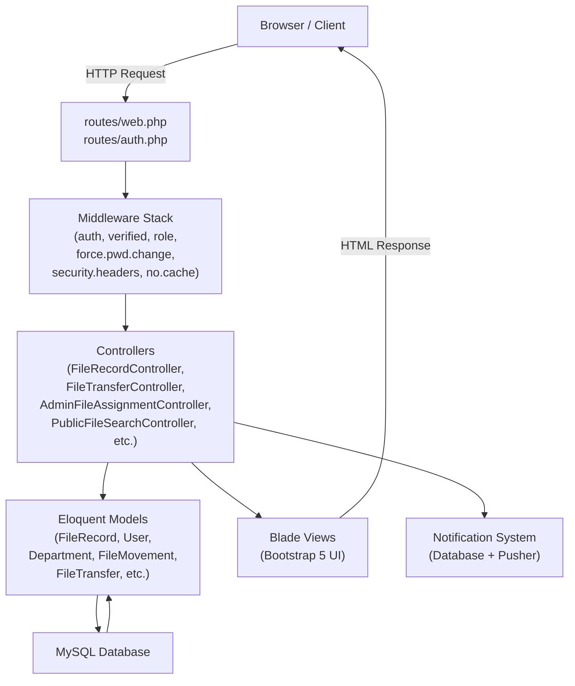
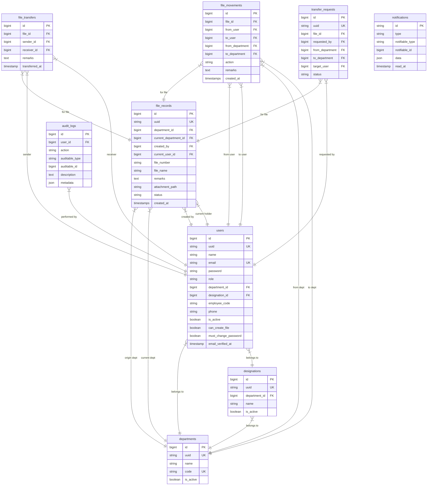
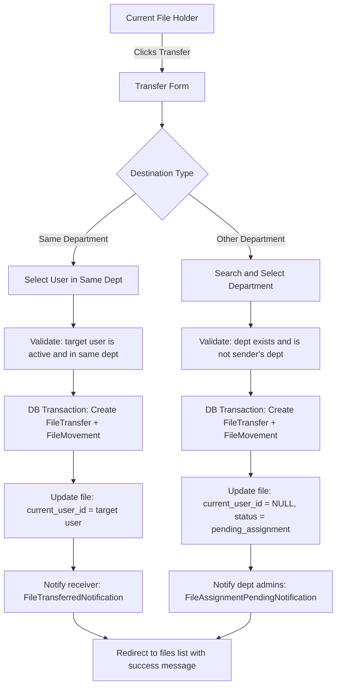
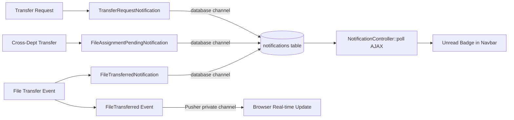
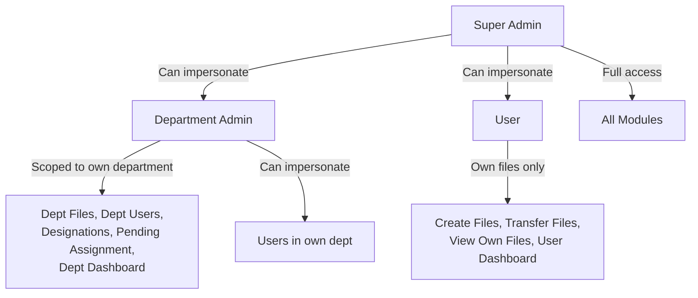
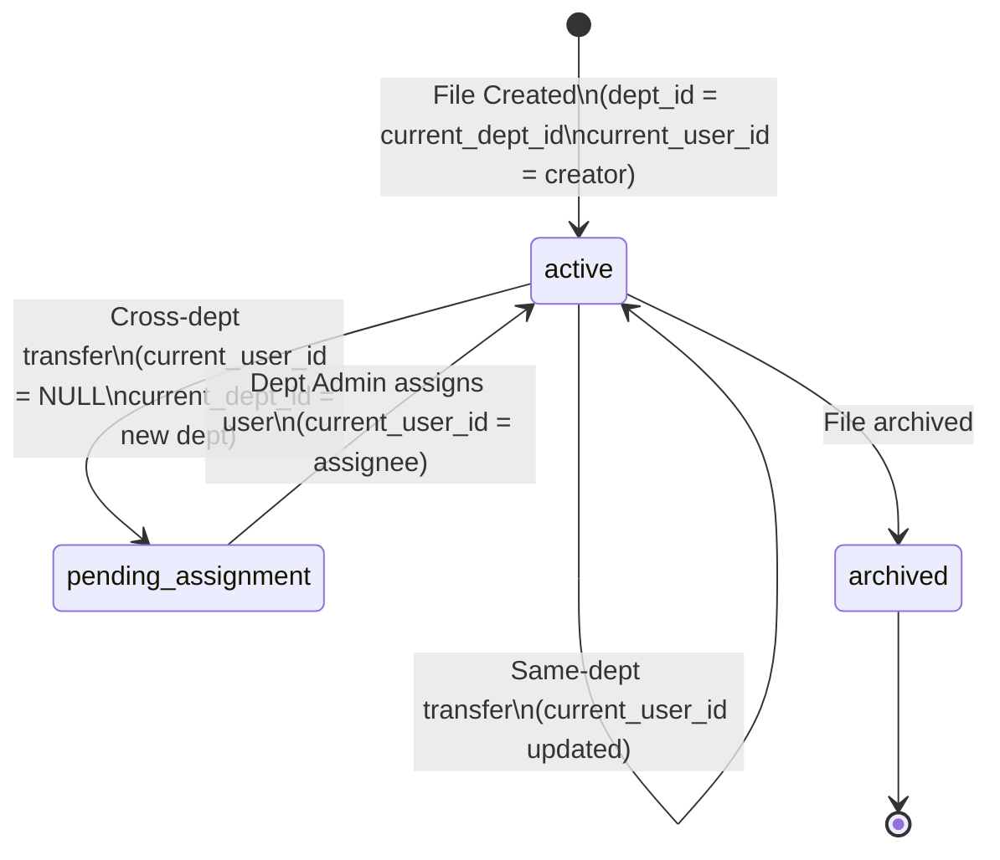

# INDUSTRIAL TRAINING REPORT

---

## COVER PAGE

**Title of Project:**
File Tracking System

**Submitted by:**
[Student Name]
B.Sc. Computer Science — [Semester / Year]
Roll No: [Roll Number]
[College / University Name]

**Organization:**
Department of Information Technology (DIT)
Government of Sikkim

**Training Period:**
1 June 2026 – 15 July 2026

**Submitted to:**
[Department of Computer Science]
[College / University Name]

**Academic Year:**
2025 – 2026

---

## CERTIFICATE

*[Placeholder — To be signed and issued by the supervising officer at the Department of Information Technology, Government of Sikkim]*

This is to certify that **[Student Name]**, Roll No. **[Roll Number]**, a student of **B.Sc. Computer Science** at **[College / University Name]**, has successfully completed the Industrial Training at the **Department of Information Technology (DIT), Government of Sikkim**, from **1 June 2026 to 15 July 2026**.

During the training period, the student actively participated in the development of the **File Tracking System**, a web-based application for tracking government files across departments. The work was carried out satisfactorily and in a professional manner.

**Signature of Supervising Officer:**
Name:
Designation:
Organization: Department of Information Technology, Government of Sikkim
Date:

**Seal of Organization:**

---


## ABSTRACT

The File Tracking System is a web-based application developed during an industrial training at the Department of Information Technology (DIT), Government of Sikkim, from 1 June 2026 to 15 July 2026. The system was built to address the challenge of tracking official government files as they move across departments, users, and offices. Before this system, file tracking was largely manual, resulting in misplaced files, delays in processing, and lack of transparency.

The application was developed using Laravel 12, PHP 8.2, MySQL, Bootstrap 5, and JavaScript, following the Model-View-Controller (MVC) architectural pattern. The system supports three user roles — Super Admin, Department Admin, and User — each with clearly defined permissions. Key features include file creation with department-scoped unique file numbers, real-time file transfer between users and departments, a department assignment queue for incoming files, a public file search portal, a complete file journey timeline, and a database notification system.

Security was given high priority. The system implements role-based access control, email verification, a forced password change on first login, session-based impersonation for administrative oversight, and HTTP security headers including Content Security Policy and X-Frame-Options. All primary records use UUID-based routing to prevent enumeration attacks.

This report documents the technologies used, the system architecture, the database design, the implementation of each module, the challenges encountered during development, and the solutions applied. The report concludes with recommendations for future enhancements.

---

## ACKNOWLEDGEMENT

I would like to express my sincere gratitude to the **Department of Information Technology (DIT), Government of Sikkim**, for providing this valuable industrial training opportunity. The experience gained during the six-week training period has been instrumental in building my practical understanding of web application development in a real-world government environment.

I am deeply thankful to my supervising officer and the technical team at DIT for their constant guidance, mentorship, and constructive feedback throughout the development of the File Tracking System.

I also extend my gratitude to the faculty of the **Department of Computer Science, [College / University Name]**, for their academic support and for encouraging industry engagement as part of the curriculum.

Finally, I thank my family and friends for their support and encouragement during this period.

---


## TABLE OF CONTENTS

| Section | Title | Page |
|---------|-------|------|
| | Cover Page | i |
| | Certificate | ii |
| | Abstract | iii |
| | Acknowledgement | iv |
| | Table of Contents | v |
| | List of Figures | vi |
| | List of Tables | vii |
| | List of Abbreviations | viii |
| **Chapter 1** | **Introduction** | |
| 1.1 | Overview of Industrial Training | |
| 1.2 | Objectives of Training | |
| 1.3 | Organization Profile | |
| 1.4 | Scope of Training | |
| **Chapter 2** | **Technologies and Tools Used** | |
| 2.1 | Laravel Framework | |
| 2.2 | PHP | |
| 2.3 | MySQL | |
| 2.4 | HTML, CSS, JavaScript, and Bootstrap 5 | |
| 2.5 | Git and GitHub | |
| **Chapter 3** | **File Tracking System Development** | |
| 3.1 | Problem Statement | |
| 3.2 | System Objectives | |
| 3.3 | System Architecture | |
| 3.4 | Database Design | |
| 3.5 | System Modules | |
| 3.6 | User Roles and Permissions | |
| 3.7 | File Transfer Workflow | |
| 3.8 | Notification System | |
| 3.9 | Public File Search | |
| 3.10 | File Journey Timeline | |
| **Chapter 4** | **Challenges and Solutions** | |
| 4.1 | Database Migration Issues | |
| 4.2 | Authentication and Authorization | |
| 4.3 | Performance Optimization | |
| 4.4 | UI/UX Improvements | |
| **Chapter 5** | **Conclusion and Future Scope** | |
| 5.1 | Conclusion | |
| 5.2 | Future Scope | |
| | References | |

---

## LIST OF FIGURES

| Figure No. | Title |
|------------|-------|
| Figure 3.1 | Landing Page |
| Figure 3.2 | Login Page |
| Figure 3.3 | Forgot Password Page |
| Figure 3.4 | Super Admin Dashboard |
| Figure 3.5 | Department Admin Dashboard |
| Figure 3.6 | User Dashboard |
| Figure 3.7 | Department Management |
| Figure 3.8 | Designation Management |
| Figure 3.9 | User Management |
| Figure 3.10 | Create User Form |
| Figure 3.11 | Create File Form |
| Figure 3.12 | File Details Page |
| Figure 3.13 | File Transfer Page |
| Figure 3.14 | Transfer Approval |
| Figure 3.15 | Pending Assignment Queue |
| Figure 3.16 | Notification Dropdown |
| Figure 3.17 | Public File Search |
| Figure 3.18 | Public Search Result |
| Figure 3.19 | File Journey Timeline |
| Figure 3.20 | Audit Logs |
| Figure 3.21 | User Profile Page |
| Figure 3.22 | Change Password Page |
| Figure 3.23 | Impersonation Banner |
| Figure 3.24 | Database ER Diagram |
| Figure 3.25 | System Architecture Diagram |

---


## LIST OF TABLES

| Table No. | Title |
|-----------|-------|
| Table 3.1 | Users Table — Column Description |
| Table 3.2 | Departments Table — Column Description |
| Table 3.3 | Designations Table — Column Description |
| Table 3.4 | File Records Table — Column Description |
| Table 3.5 | File Movements Table — Column Description |
| Table 3.6 | File Transfers Table — Column Description |
| Table 3.7 | Transfer Requests Table — Column Description |
| Table 3.8 | Notifications Table — Column Description |
| Table 3.9 | Audit Logs Table — Column Description |
| Table 3.10 | User Role Permissions Matrix |

---

## LIST OF ABBREVIATIONS

| Abbreviation | Full Form |
|-------------|-----------|
| MVC | Model-View-Controller |
| DIT | Department of Information Technology |
| PHP | Hypertext Preprocessor |
| HTML | HyperText Markup Language |
| CSS | Cascading Style Sheets |
| JS | JavaScript |
| DB | Database |
| UUID | Universally Unique Identifier |
| FK | Foreign Key |
| ORM | Object-Relational Mapping |
| RBAC | Role-Based Access Control |
| CSP | Content Security Policy |
| API | Application Programming Interface |
| AJAX | Asynchronous JavaScript and XML |
| URL | Uniform Resource Locator |
| HTTP | HyperText Transfer Protocol |
| HTTPS | HyperText Transfer Protocol Secure |
| SQL | Structured Query Language |
| VCS | Version Control System |
| IDE | Integrated Development Environment |
| UI | User Interface |
| UX | User Experience |
| DRY | Don't Repeat Yourself |

---


---

# CHAPTER 1 — INTRODUCTION

## 1.1 Overview of Industrial Training

Industrial training is a compulsory component of the B.Sc. Computer Science programme. It provides students with practical exposure to real-world software development environments and bridges the gap between academic learning and industry practice. During this training, students apply theoretical knowledge to solve genuine problems faced by organizations.

The industrial training for this report was carried out at the **Department of Information Technology (DIT), Government of Sikkim**, for a period of six weeks, from **1 June 2026 to 15 July 2026**. The training involved designing, developing, testing, and partially deploying a web-based **File Tracking System** intended for use by government departments to track the movement of official files.

## 1.2 Objectives of Training

The key objectives of the industrial training were as follows:

1. To gain hands-on experience in full-stack web development using Laravel 12 and PHP 8.2.
2. To understand and implement the MVC architectural pattern in a production-grade application.
3. To design and manage a relational MySQL database with proper indexing and referential integrity.
4. To implement role-based access control for a multi-role government application.
5. To develop secure authentication flows including email verification and forced password change.
6. To learn professional practices such as version control with Git, code reviews, and documentation.
7. To develop skills in building responsive user interfaces using Bootstrap 5.
8. To understand how database notifications work in Laravel's notification system.
9. To practise writing automated feature tests using the Pest framework.
10. To experience the software development lifecycle in a real government department setting.

## 1.3 Organization Profile

The **Department of Information Technology (DIT)**, Government of Sikkim, is the nodal department responsible for planning, coordination, and implementation of IT initiatives across the state government. DIT is involved in the development and maintenance of e-governance platforms, digital infrastructure, and citizen-facing digital services.

DIT promotes the use of technology to improve the efficiency, transparency, and accountability of government functions. The department works with various line departments to digitize processes that were previously paper-based, reducing delays and improving public service delivery.

## 1.4 Scope of Training

The scope of work during the training period covered the complete development lifecycle of the File Tracking System, including:

- Requirements gathering and analysis with the department team.
- Database design and creation of all migration files.
- Backend development using Laravel 12 controllers, models, middleware, and policies.
- Frontend development using Blade templates, Bootstrap 5, and JavaScript.
- Implementation of authentication, authorization, and security features.
- Development of the file transfer, department assignment, and notification workflows.
- Building a public-facing file search portal.
- Writing automated tests using Pest.
- Version control and collaboration using Git and GitHub.

---


# CHAPTER 2 — TECHNOLOGIES AND TOOLS USED

## 2.1 Laravel Framework

Laravel is an open-source PHP web application framework following the MVC pattern. Version 12, used in this project, introduced a modernised application skeleton, improved routing performance, and streamlined middleware registration through the `bootstrap/app.php` configuration file.

In this project, Laravel was used for:

- **Routing** — All application routes are defined in `routes/web.php` and `routes/auth.php`. Route groups apply layered middleware stacks such as `['auth', 'verified', 'no.cache', 'force.pwd.change']`.
- **Eloquent ORM** — Models such as `FileRecord`, `User`, `Department`, `FileMovement`, and `FileTransfer` define relationships using `belongsTo`, `hasMany`, and `morphTo`, enabling expressive database queries without writing raw SQL.
- **Blade Templating** — All views are written in Blade, Laravel's templating engine, allowing reusable layouts, components, and conditional rendering.
- **Artisan CLI** — Used extensively for generating migrations, running `php artisan migrate:fresh --seed`, and executing tests with `php artisan test`.
- **Database Migrations** — Twenty-six migration files define every table, column, index, foreign key, and constraint in the system.
- **Notifications** — Laravel's built-in notification system is used to deliver database notifications. Three notification classes are implemented: `FileTransferredNotification`, `FileAssignmentPendingNotification`, and `TransferRequestNotification`.
- **Events and Broadcasting** — The `FileTransferred` event implements `ShouldBroadcast` and uses Pusher private channels for real-time notification delivery to authenticated users.
- **Policies** — File access and transfer authorisation is enforced through policy classes, using `$this->authorize('transfer', $file)` in controllers.
- **Middleware** — Custom middleware classes handle role access (`RoleMiddleware`), forced password change (`ForcePasswordChangeMiddleware`), security headers (`SecurityHeadersMiddleware`), and cache prevention (`NoCacheMiddleware`).

## 2.2 PHP

PHP 8.2 is the server-side scripting language used in this project. Key PHP 8.2 features utilised include:

- **Named arguments and constructor property promotion** in service classes and notification constructors, for example `public readonly FileTransfer $transfer`.
- **Match expressions** used in the dashboard route to direct users to the correct role-specific dashboard.
- **Fibers and typed properties** for cleaner code throughout controllers.
- **Str::uuid()** from Laravel's helper library, which wraps PHP's `ramsey/uuid` package, is used to auto-generate UUIDs for all primary models in their `boot()` methods.

## 2.3 MySQL

MySQL is the relational database management system. The database schema consists of over fifteen tables connected through foreign key constraints. Key database design decisions include:

- **Composite unique constraint** on `(department_id, file_number)` in `file_records`, ensuring file numbers are unique within a department but can be reused across departments.
- **UUID columns** on `users`, `file_records`, `departments`, and `designations` for public-facing URLs, preventing sequential ID enumeration.
- **Performance indexes** on `status`, `current_user_id`, `created_at`, `action`, and `role` columns to support fast queries.
- **Soft deletes** and **cascade constraints** to maintain referential integrity when parent records are deleted.

## 2.4 HTML, CSS, JavaScript, and Bootstrap 5

The frontend is built using:

- **Bootstrap 5.3.3** — Provides the responsive grid system, navigation, cards, modals, badges, and utility classes used throughout all views.
- **Font Awesome 6.5.2** — Icon library used for all UI icons, including navigation, status indicators, and action buttons.
- **Inter font (Google Fonts)** — Primary typeface for the landing page.
- **Vanilla JavaScript** — Used for the notification polling endpoint, department autocomplete in the file transfer form using the AJAX endpoint `/ajax/departments/search`, the reveal animation on the landing page using `IntersectionObserver`, and Bootstrap dropdown initialisation.
- **Custom CSS** — `public/css/app-custom.css` provides the complete styling for the landing page including the hero section, glass-card components, workflow rail, and all responsive media queries.

## 2.5 Git and GitHub

Git was used as the version control system throughout the project. GitHub was used as the remote repository host. Key practices followed:

- Feature branches were used for each major module.
- Commits followed a descriptive convention to trace changes.
- GitHub Actions workflows (`.github/workflows/laravel.yml` and `php.yml`) were configured for automated testing and linting on push.
- The `.env` file was excluded from version control using `.gitignore`.

---


# CHAPTER 3 — FILE TRACKING SYSTEM DEVELOPMENT

## 3.1 Problem Statement

Government departments handle a large volume of physical and digital files daily. These files move between officials, sections, and departments during their processing lifecycle. Prior to this system, the movement of files was tracked manually using registers, leading to several problems:

- Files were frequently lost or misplaced during inter-department movement.
- There was no real-time visibility into the current location or status of a file.
- Accountability was unclear — there was no record of who last held a file or where it was transferred.
- Citizens and applicants had no way to check the status of their submitted files.
- Audit trails were incomplete or unavailable, making it difficult to investigate delays.

The File Tracking System was developed to solve these problems by providing a digital platform for registering, transferring, and tracking official files with complete transparency and accountability.

## 3.2 System Objectives

The system was designed to achieve the following objectives:

1. Provide a centralised platform for registering government files with unique department-scoped file numbers.
2. Enable immediate file transfer between users within the same department and across departments.
3. Maintain a complete, immutable movement history for every file from creation to delivery.
4. Implement role-based access so Super Admins, Department Admins, and Users each see appropriate data.
5. Allow Department Admins to manage incoming files and assign them to users.
6. Notify relevant users and admins immediately when files are transferred or assigned.
7. Provide a public search portal for citizens and staff to check file status without logging in.
8. Ensure security through email verification, forced password change on first login, HTTP security headers, and UUID-based routing.

## 3.3 System Architecture

The system follows the **Model-View-Controller (MVC)** architecture provided by Laravel.



**Figure 3.25 — System Architecture Diagram**

```
[Insert Screenshot: System Architecture Diagram]
Description: Illustrates the MVC architecture of the File Tracking System, showing
the flow from the browser through middleware, controllers, models, database, and views.
```

The key architectural components are:

- **Routes** define URL patterns and associate them with controller methods. Middleware stacks are applied at the route group level.
- **Middleware** intercepts every request before it reaches the controller. The middleware chain for protected routes is: `auth` → `verified` → `no.cache` → `force.pwd.change` → `role`.
- **Controllers** contain the business logic. Separate controllers exist for file records, file transfers, department assignment, public search, notifications, user management, and impersonation.
- **Models** represent database tables and define relationships. Eloquent models handle UUID generation in `boot()` and provide scoped query methods.
- **Views** are Blade templates that render the HTML. Layouts are shared through Blade's `@extends` and `@section` directives.
- **Services** — A `DashboardService` class provides cached dashboard statistics to reduce repeated database queries.


## 3.4 Database Design

The database consists of fifteen core tables. All relationships are enforced using MySQL foreign key constraints.

### ER Diagram



**Figure 3.24 — Database ER Diagram**

```
[Insert Screenshot: Database ER Diagram]
Description: Entity-Relationship diagram showing all tables and their foreign key
relationships in the File Tracking System database.
```

### Table Descriptions

**Table 3.1 — users**

| Column | Type | Description |
|--------|------|-------------|
| id | BIGINT PK | Auto-increment primary key |
| uuid | VARCHAR(36) UK | Public-facing unique identifier |
| name | VARCHAR(255) | Full name of the user |
| email | VARCHAR(255) UK | Login email address |
| password | VARCHAR | Bcrypt-hashed password |
| role | ENUM | `super_admin`, `admin`, or `user` |
| department_id | BIGINT FK | Department the user belongs to |
| designation_id | BIGINT FK | Designation within the department |
| is_active | BOOLEAN | Whether the user account is active |
| can_create_file | BOOLEAN | Permission to create new files |
| must_change_password | BOOLEAN | Forces password change on next login |
| email_verified_at | TIMESTAMP | Email verification timestamp |


**Table 3.2 — departments**

| Column | Type | Description |
|--------|------|-------------|
| id | BIGINT PK | Auto-increment primary key |
| uuid | VARCHAR(36) UK | Public-facing unique identifier |
| name | VARCHAR(255) | Department full name |
| code | VARCHAR(20) UK | Short department code (e.g., ADMIN, IT) |
| is_active | BOOLEAN | Whether the department is active |

**Table 3.3 — designations**

| Column | Type | Description |
|--------|------|-------------|
| id | BIGINT PK | Auto-increment primary key |
| uuid | VARCHAR(36) UK | Public-facing unique identifier |
| department_id | BIGINT FK | Parent department |
| name | VARCHAR(255) | Designation title |
| is_active | BOOLEAN | Whether the designation is active |

**Table 3.4 — file_records**

| Column | Type | Description |
|--------|------|-------------|
| id | BIGINT PK | Auto-increment primary key |
| uuid | VARCHAR(36) UK | Public-facing unique identifier |
| department_id | BIGINT FK | Originating department (never changes) |
| current_department_id | BIGINT FK | Department currently holding the file |
| created_by | BIGINT FK | User who created the file |
| current_user_id | BIGINT FK | User currently holding the file (NULL if dept-owned) |
| file_number | VARCHAR(100) | File number (unique within originating department) |
| file_name | VARCHAR(255) | Descriptive name of the file |
| remarks | TEXT | Notes added during creation |
| attachment_path | VARCHAR | Path to uploaded attachment file |
| attachment_name | VARCHAR | Original filename of attachment |
| attachment_mime | VARCHAR | MIME type of attachment |
| status | ENUM | `active`, `pending_assignment`, `draft`, `archived` |

> **Note:** A composite unique constraint `UNIQUE(department_id, file_number)` ensures file numbers are unique within a department but can be reused in different departments. A separate index on `(current_department_id, file_number)` supports fast lookups of files by their current holder.

**Table 3.5 — file_movements**

| Column | Type | Description |
|--------|------|-------------|
| id | BIGINT PK | Auto-increment primary key |
| file_id | BIGINT FK | The file being moved |
| from_user | BIGINT FK | User who sent or created |
| to_user | BIGINT FK | User who received (NULL for dept transfers) |
| from_department | BIGINT FK | Source department |
| to_department | BIGINT FK | Destination department |
| action | VARCHAR | `created` or `transferred` |
| remarks | TEXT | Optional remarks for the movement |

**Table 3.6 — file_transfers**

| Column | Type | Description |
|--------|------|-------------|
| id | BIGINT PK | Auto-increment primary key |
| file_id | BIGINT FK | The transferred file |
| sender_id | BIGINT FK | User who initiated the transfer |
| receiver_id | BIGINT FK | Receiving user (NULL for cross-dept) |
| remarks | TEXT | Optional transfer notes |
| transferred_at | TIMESTAMP | Date and time of transfer |

**Table 3.7 — transfer_requests**

| Column | Type | Description |
|--------|------|-------------|
| id | BIGINT PK | Auto-increment primary key |
| uuid | VARCHAR(36) UK | Public-facing unique identifier |
| file_id | BIGINT FK | The requested file |
| requested_by | BIGINT FK | User who made the request |
| from_department | BIGINT FK | Source department |
| to_department | BIGINT FK | Target department |
| target_user | BIGINT FK | Target user for assignment |
| status | VARCHAR | Request status |

**Table 3.8 — notifications**

| Column | Type | Description |
|--------|------|-------------|
| id | VARCHAR(36) PK | UUID primary key |
| type | VARCHAR | Notification class name |
| notifiable_type | VARCHAR | Polymorphic model type |
| notifiable_id | BIGINT | Polymorphic model ID |
| data | JSON | Notification payload |
| read_at | TIMESTAMP | When the notification was read |

**Table 3.9 — audit_logs**

| Column | Type | Description |
|--------|------|-------------|
| id | BIGINT PK | Auto-increment primary key |
| user_id | BIGINT FK | User who performed the action |
| action | VARCHAR | Action type (indexed) |
| auditable_type | VARCHAR | Polymorphic model type |
| auditable_id | BIGINT | Polymorphic model ID |
| description | TEXT | Human-readable description |
| metadata | JSON | Additional context data |

### UUID Usage

Every primary model (`User`, `Department`, `Designation`, `FileRecord`, `TransferRequest`, `PublicFile`) generates a UUID automatically in the Eloquent `boot()` method using `Str::uuid()->toString()`. The `getRouteKeyName()` method is overridden to return `'uuid'`, so all URLs use UUIDs instead of numeric IDs. This prevents sequential enumeration attacks where an attacker could guess resource IDs by incrementing integers.

### Indexes and Foreign Keys

Performance-critical columns carry explicit indexes:

- `file_records.status` — speeds up status filter queries.
- `file_records.current_user_id` — speeds up queries for files a user currently holds.
- `file_records.created_at` — speeds up date-range filter queries.
- `file_movements.action` — speeds up movement history filtering.
- `users.role` — speeds up role-based queries.
- Composite index `(current_department_id, file_number)` — supports fast public search lookups.

All foreign keys use `onDelete('cascade')` or `nullOnDelete()` to maintain referential integrity without orphaned records.


## 3.5 System Modules

### Module 1 — Authentication

**Purpose:** Securely manage user login, logout, email verification, password reset, and forced password change.

**Workflow:**
1. A user visits `/login` and submits their email and password.
2. Laravel's `AuthenticatedSessionController` validates credentials using `LoginRequest`, which applies rate limiting (5 attempts per minute).
3. On success, the user is redirected to `/dashboard`. The dashboard route uses a `match` expression to redirect to the role-appropriate dashboard (`super_admin.dashboard`, `admin.dashboard`, or `user.dashboard`).
4. If the user's email is not verified, the `verified` middleware redirects them to `/verify-email`.
5. If the user's `must_change_password` flag is `true`, the `ForcePasswordChangeMiddleware` redirects every request to `/profile` until the password is changed.
6. Password reset uses Laravel's built-in signed URL email mechanism.

**Implementation Summary:** The middleware chain `['auth', 'verified', 'no.cache', 'force.pwd.change']` enforces the complete authentication gate for all protected routes. The `ForcePasswordChangeMiddleware` is not applied globally — only to route groups that already require `verified` — to prevent an infinite redirect loop between `/verify-email` and `/profile`.

```
[Insert Screenshot: Login Page]
Figure 3.2 — Login Page
Description: The secure login page where users enter their email and password.
Rate limiting is applied (5 attempts per minute). The page uses Bootstrap 5
form components with custom styling.
```

```
[Insert Screenshot: Forgot Password Page]
Figure 3.3 — Forgot Password Page
Description: The password reset request form where users enter their registered
email address. Laravel sends a signed password reset link.
```

```
[Insert Screenshot: Change Password Page]
Figure 3.22 — Change Password Page
Description: The profile page's password section where users with must_change_password
= true are redirected. Shows current password, new password, and confirmation fields.
```

---

### Module 2 — User Management

**Purpose:** Allow Super Admins and Department Admins to create and manage user accounts.

**Workflow:**

- **Super Admin** uses `UserController` to create users of any role (`admin` or `user`) and assign them to any department.
- **Department Admin** uses `AdminUserController`, which scopes all operations to `Auth::user()->department_id`. Only `user`-role accounts can be created. Designations are filtered to the admin's department.
- When a new user is created, the default password is `Password@123` and `must_change_password` is set to `true`, forcing the user to change the password on first login.
- The admin can activate or deactivate accounts using the `is_active` flag.
- The `can_create_file` boolean controls whether a user is permitted to create new file records.

**Implementation Summary:** `AdminUserController::resolveUser()` scopes UUID-based lookups to the admin's department, preventing cross-department data access. Profile photos are stored in `public` disk under `uploads/users/` using a UUID filename.

```
[Insert Screenshot: User Management]
Figure 3.9 — User Management
Description: Admin's user list showing names, designations, active status,
and action buttons for edit, impersonate, and delete.
```

```
[Insert Screenshot: Create User Form]
Figure 3.10 — Create User Form
Description: Form for creating a new user. Fields include name, email,
designation, contact number, profile photo upload, and file creation permission toggle.
```

---

### Module 3 — Department Management

**Purpose:** Allow Super Admins to create, edit, and manage government departments.

**Workflow:** The `DepartmentController` handles CRUD operations for departments. Each department has a name, a unique short code (e.g., `IT`, `FIN`, `HR`), and an `is_active` flag. Departments are assigned to users and files. An AJAX endpoint (`/ajax/departments/create`) allows inline department creation directly from the file creation form.

**Implementation Summary:** Departments use UUID routing. The `Department` model defines `hasMany` relationships to `User`, `Designation`, and `FileRecord`.

```
[Insert Screenshot: Department Management]
Figure 3.7 — Department Management
Description: Super Admin's department list showing department names, codes,
active status, and action buttons.
```

---

### Module 4 — Designation Management

**Purpose:** Allow Super Admins and Department Admins to manage job designations within departments.

**Workflow:** Designations are created under a department and assigned to users. The `DesignationController` handles the full CRUD lifecycle. Designations are scoped to their parent department, so Department Admins only see designations from their own department.

```
[Insert Screenshot: Designation Management]
Figure 3.8 — Designation Management
Description: Designation list page showing designation names and their parent
department. Used to classify user roles within a department.
```


---

### Module 5 — File Creation

**Purpose:** Allow authorised users to register a new official file in the system.

**Workflow:**
1. A user with `can_create_file = true` navigates to `/files/create`.
2. The `FileRecordController::create()` method loads all active departments and renders the creation form.
3. The user fills in the file number, file name, originating department, optional remarks, and an optional attachment.
4. On submission, `FileRecordController::store()` normalises the file number to uppercase, then validates:
   - File number uniqueness is scoped to the selected department using `Rule::unique('file_records', 'file_number')->where('department_id', ...)`. The same file number may exist in different departments.
   - The file number may only contain letters, numbers, hyphens, slashes, dots, and spaces.
   - Attachments are limited to PDF, Word, Excel, PowerPoint, and image formats, with a 10 MB size limit.
5. On success, a `FileRecord` is created with `status = 'active'`, `department_id` and `current_department_id` both set to the selected department, and `current_user_id` set to the creating user.
6. A `FileMovement` record is inserted with `action = 'created'`, recording the creation as the first entry in the file's history.
7. Attachments are stored on the `private` disk under `files/{uuid}/` using a UUID filename to prevent directory traversal or name collision.

**Benefits:** Every file gets an immutable origin record. The UUID-based file path prevents direct URL access to attachments. The department-scoped file number uniqueness enforced at both the validation and database layers eliminates duplicates within a department while allowing the same number to be reused in different departments.

```
[Insert Screenshot: Create File Form]
Figure 3.11 — Create File Form
Description: The file creation form showing fields for file number, file name,
department selection, remarks, and file attachment upload. Validation error
messages appear inline when the file number is a duplicate within the selected department.
```

```
[Insert Screenshot: File Details Page]
Figure 3.12 — File Details Page
Description: The detailed view of a single file record showing file number, name,
origin department, current holder, status, attachment download link, remarks,
and the complete movement history timeline.
```

---

### Module 6 — File Transfer

**Purpose:** Enable the current holder of a file to transfer it either to another user in the same department or to a different department entirely.

**Workflow:**



**Figure 3.13 — File Transfer Workflow Diagram**

Key implementation details:

- Transfer authorization is **ownership-based**, not role-based. Only the user whose ID matches `current_user_id` can transfer a file, enforced via Laravel Policy and a race-condition guard in the controller.
- **Same-department transfer:** `current_user_id` is updated to the receiver, `status` remains `active`. A `FileTransferredNotification` is sent to the receiver via the database channel.
- **Cross-department transfer:** `current_user_id` is set to `NULL`, `current_department_id` is updated to the target department, and `status` is set to `pending_assignment`. All admins of the receiving department receive a `FileAssignmentPendingNotification`.
- The entire operation is wrapped in a `DB::transaction()` to ensure atomicity — if any step fails, all changes are rolled back.
- The `FileTransferred` event fires after the transaction and broadcasts to the receiver's private Pusher channel (`user.{id}`) for real-time notification delivery.
- The `department_id` (origin) column is **never modified** during transfer, preserving the file's identity.

```
[Insert Screenshot: File Transfer Page]
Figure 3.13 — File Transfer Page
Description: The transfer form showing two destination options — Same Department
(with user dropdown) and Other Department (with department autocomplete search).
The current file number and name are displayed for confirmation.
```

---

### Module 7 — Department Assignment

**Purpose:** Allow a Department Admin to assign an incoming file (in `pending_assignment` status) to a specific user within their department.

**Workflow:**
1. When a file is transferred cross-department, it arrives with `current_user_id = NULL` and `status = pending_assignment`.
2. The Department Admin navigates to `/admin/files/pending`, handled by `AdminFileAssignmentController::index()`.
3. The controller queries all `FileRecord` rows where `current_department_id` matches the admin's department, `current_user_id IS NULL`, and `status = 'pending_assignment'`.
4. The admin selects a user from their department and submits the assignment form.
5. `AdminFileAssignmentController::assign()` validates that the selected user belongs to the admin's department and is active.
6. A `FileMovement` is created with `action = 'transferred'` and a remark indicating assignment. A `FileTransfer` record is also created for the user's activity feed.
7. The file is updated: `current_user_id = selected user`, `status = 'active'`.
8. The assigned user receives a `FileTransferredNotification`.

**Benefits:** This design supports a clear chain of custody. A file can never be left unowned — it is either held by a named user or queued in a department's pending list awaiting assignment. Department Admins have full visibility over incoming work.

```
[Insert Screenshot: Pending Assignment Queue]
Figure 3.15 — Pending Assignment Queue
Description: The admin's pending files page showing all files transferred to their
department that are awaiting user assignment. Each row shows the file number, name,
sender, and a dropdown to select the user for assignment.
```

---

### Module 8 — Dashboard

**Purpose:** Provide role-appropriate summary views and quick access to recent activity.

**Workflow:** The `AdminDashboardController` uses a `DashboardService` to fetch cached statistics and recent data. Results are cached to avoid repeated expensive queries.

- **Super Admin Dashboard** receives: total files, total departments, total users, total transfers, total admins, movement statistics breakdown, per-department file counts, and recent transfers and movements.
- **Department Admin Dashboard** receives: files in their department, users in their department, total transfer count, pending assignment count, recent files, recent activity, recent users, and pending files list.
- **User Dashboard** (`UserDashboardController`) receives: files the user created or currently holds, files received by the user, files sent by the user, recent activity movements, and unread notifications.

```
[Insert Screenshot: Dashboard — Super Admin]
Figure 3.4 — Super Admin Dashboard
Description: The Super Admin's dashboard showing system-wide statistics including
total files, departments, users, and transfers. Includes per-department file count
chart and recent transfer activity table.
```

```
[Insert Screenshot: Dashboard — Department Admin]
Figure 3.5 — Department Admin Dashboard
Description: The Department Admin's dashboard showing department-scoped file count,
pending assignments badge, recent files, and recent activity.
```

```
[Insert Screenshot: Dashboard — User]
Figure 3.6 — User Dashboard
Description: The regular user's dashboard showing files they hold, files sent,
files received, and recent activity feed.
```

---

### Module 9 — Notification System

**Purpose:** Inform users and admins of file-related events in real time.

**Workflow:**



Three notification classes are implemented:

| Notification Class | Trigger | Recipient |
|---|---|---|
| `FileTransferredNotification` | File transferred to a user | The receiving user |
| `FileAssignmentPendingNotification` | File transferred cross-department | All admins of receiving dept |
| `TransferRequestNotification` | Transfer request submitted | Source department admin |

All notifications use the `database` channel, storing a JSON payload in the `notifications` table. The payload includes `type`, `title`, `message`, `icon`, `color`, `url`, `file_number`, and `sender`. The `NotificationController` provides:

- `GET /notifications` — full notifications page with paginated history.
- `GET /notifications/poll` — AJAX endpoint returning the unread notification count, used by the navbar badge to poll for updates.
- `POST /notifications/read-visible` — marks all currently-visible notifications as read when the dropdown is opened.

The `FileTransferred` event additionally broadcasts to a Pusher private channel (`user.{receiver_id}`) using `ShouldBroadcast`, enabling real-time delivery without page refresh.

```
[Insert Screenshot: Notification Dropdown]
Figure 3.16 — Notification Dropdown
Description: The notification bell dropdown in the navbar showing unread notifications
with icons, messages, timestamps, and links to the relevant file. The unread count
badge is updated via AJAX polling.
```


---

## 3.6 User Roles and Permissions

The system implements Role-Based Access Control (RBAC) through the `RoleMiddleware` and Laravel Policies. Three roles are defined in the `users.role` column.



**Table 3.10 — User Role Permissions Matrix**

| Feature | Super Admin | Department Admin | User |
|---------|:-----------:|:----------------:|:----:|
| View all files (system-wide) | ✓ | — | — |
| View dept files (current dept) | ✓ | ✓ | — |
| View own files | ✓ | ✓ | ✓ |
| Create files | — | ✓ (if enabled) | ✓ (if enabled) |
| Transfer files | ✓ (if holder) | ✓ (if holder) | ✓ (if holder) |
| Assign pending files | — | ✓ | — |
| Manage all departments | ✓ | — | — |
| Manage all users | ✓ | — | — |
| Manage dept users | — | ✓ | — |
| Manage designations | ✓ | ✓ | — |
| View admin panel | ✓ | ✓ | — |
| Impersonate admins/users | ✓ | — | — |
| Impersonate dept users | — | ✓ | — |
| View audit logs | ✓ | — | — |
| Manage backups | ✓ | — | — |
| Public file search | ✓ | ✓ | ✓ (unauthenticated) |

The `canImpersonate()` method in the `User` model enforces the impersonation hierarchy in code:
- A Super Admin can impersonate any admin or user but not another Super Admin.
- A Department Admin can impersonate only users within their own department.
- A User cannot impersonate anyone.

---

## 3.7 File Transfer Workflow

The complete lifecycle of a file from creation to final delivery involves multiple state transitions tracked in the `file_movements` table.



**Key invariant:** The `department_id` column (origin department) is set at creation and never updated. Only `current_department_id` and `current_user_id` change as the file moves. This design means the composite unique constraint `UNIQUE(department_id, file_number)` is never violated by a transfer — even if the file moves to a department that already has a file with the same number.

---

## 3.8 Notification System

Refer to **Module 9** (Section 3.5) for the detailed notification workflow. Key points:

- All notifications are stored in the `notifications` table (Laravel's default polymorphic notification table).
- The notification payload is a JSON object with a consistent structure: `type`, `title`, `message`, `icon`, `color`, `url`, `file_number`, `sender`.
- Unread count is retrieved via AJAX polling (`/notifications/poll`) every 30 seconds in the navbar, updating the badge without a page reload.
- Marking notifications as read uses `POST /notifications/read-visible`, triggered when the user opens the notification dropdown.

---

## 3.9 Public File Search

**Purpose:** Allow citizens, applicants, and staff to verify the status of a government file without logging in.

**Workflow:**
1. Anyone visits `/public/file-search` — no authentication required.
2. The user enters a file number and optionally selects a department.
3. `PublicFileSearchController::search()` queries `file_records` by `file_number`. If a department UUID is provided, it adds a `whereHas('department', ...)` scope to filter by origin department.
4. If multiple files match the file number (same number in different departments), the controller returns a `department_choices` array so the user can select the correct department.
5. If a single match is found, the response includes a safe public summary: file number, file name, origin department, current department, current holder name, status, and creation date. **No email, employee ID, or internal data is exposed.**
6. The `buildPublicJourney()` method collapses the raw `FileMovement` records into department-level milestones, grouping consecutive movements in the same department into a single node. This protects internal user routing details while providing transparent department-level tracking.

```
[Insert Screenshot: Public File Search]
Figure 3.17 — Public File Search
Description: The unauthenticated public search page with a file number input field
and optional department dropdown. Available to all visitors without login.
```

```
[Insert Screenshot: Public Search Result]
Figure 3.18 — Public Search Result
Description: The search result showing the file's public summary (file number, name,
departments, status) and the department-level journey timeline below it.
```

---

## 3.10 File Journey Timeline

**Purpose:** Provide a complete, chronological record of every movement a file has undergone since its creation.

**Workflow:**
- For authenticated users, the file show page (`/files/{uuid}`) loads all `FileMovement` records via eager loading with `movements.fromUser`, `movements.toUser`, `movements.fromDept`, and `movements.toDept` relationships.
- The timeline displays each movement as a node: creation date, action type (`created` / `transferred`), sender, receiver, source department, destination department, and remarks.
- For Super Admin and Department Admin, the `FileTimelineController` renders the admin timeline at `/admin/files/{uuid}/timeline`, showing additional internal details.
- Department Admins can only access timelines of files that originate from or are currently in their department, enforced by `authorizeFile()` in the timeline controller.
- For the public portal, the `buildPublicJourney()` method collapses the timeline to department-level milestones only, hiding individual user details.

```
[Insert Screenshot: File Journey Timeline]
Figure 3.19 — File Journey Timeline
Description: The admin-facing file timeline showing a horizontal linked list of
all movements with timestamps, user names, department names, action types, and remarks.
Each movement node is colour-coded by action type.
```

---

### Module 10 — User Impersonation

**Purpose:** Allow administrators to log in as another user temporarily for support, debugging, and verification purposes.

**Workflow:**
1. A Super Admin or Department Admin clicks the impersonate button next to a user in the user management list.
2. `ImpersonationController::start()` validates that the current user is permitted to impersonate the target using `canImpersonate()`.
3. The impersonator's ID and name are saved to the session (`impersonator_id`, `impersonator_name`).
4. `Auth::login($user)` switches the authenticated session to the target user.
5. A yellow impersonation banner is displayed on every page informing the admin that they are acting as another user and providing a "Stop Impersonation" button.
6. The `ForcePasswordChangeMiddleware` skips the password change check when `impersonator_id` is present in the session, preventing the admin from being redirected to the impersonated user's password change page.
7. `ImpersonationController::stop()` restores the original impersonator's session and redirects to the dashboard.

```
[Insert Screenshot: Impersonation Banner]
Figure 3.23 — Impersonation Banner
Description: The yellow warning banner visible at the top of every page during an
active impersonation session. Shows the name of the user being impersonated and
a button to stop the session.
```

---

### Module 11 — Audit Logs

**Purpose:** Maintain an immutable log of significant system actions for accountability and investigation.

**Workflow:** The `AuditLog` model uses a polymorphic relationship (`auditable_type`, `auditable_id`) to associate log entries with any model. Log entries capture the `user_id`, `action`, a human-readable `description`, and a `metadata` JSON field for additional context. The Super Admin can view all audit logs through the admin panel, filtered by action type or date range.

```
[Insert Screenshot: Audit Logs]
Figure 3.20 — Audit Logs
Description: The Super Admin's audit log page showing a table of all recorded
system actions with user name, action type, description, related model, and timestamp.
```

---

### Module 12 — Landing Page

**Purpose:** Provide a professional public-facing portal homepage for the File Tracking System.

**Workflow:** The `LandingPageController::index()` method fetches system statistics (total departments, users, files, and transfers) using a 10-minute cache via `Cache::remember('landing_stats', 600, ...)`. These live statistics are displayed in the hero section of the landing page as trust indicators.

The landing page is divided into sections: hero, overview, features, workflow illustration, file journey preview, security, technology stack, preview tiles, and contact/help. Scroll-reveal animations are implemented using `IntersectionObserver`. The page is fully responsive with mobile-specific breakpoints defined in `app-custom.css`.

```
[Insert Screenshot: Landing Page]
Figure 3.1 — Landing Page
Description: The public-facing landing page of the FileTrack Office Portal showing
the hero section with live statistics, feature cards, workflow steps, and navigation.
```

---

### Module 13 — User Profile

**Purpose:** Allow users to view and update their profile information and change their password.

**Workflow:** The `ProfileController` handles profile updates, photo uploads, password changes, and account deletion. When a user changes their email address, `email_verified_at` is set to `NULL`, requiring re-verification. Profile photos are stored on the `public` disk under `avatars/` using a UUID filename. Account deletion logs the user out, deletes the record, and redirects to the landing page.

```
[Insert Screenshot: User Profile]
Figure 3.21 — User Profile Page
Description: The profile edit page showing name, email, phone, contact number,
and profile photo upload fields. Includes a separate password change section below.
```


---

# CHAPTER 4 — CHALLENGES AND SOLUTIONS

## 4.1 Database Migration Issues

**Challenge 1: Composite Unique Constraint vs. Global Unique Constraint**

The initial schema used a global `UNIQUE(file_number)` constraint on the `file_records` table. This design worked for small datasets but became a problem when the requirement emerged that different departments should be able to use the same file number independently. A file numbered `FILE-1001` in the Administration department needed to coexist with a `FILE-1001` in the Finance department.

**Solution:** The global unique index was dropped and replaced with a composite unique constraint: `UNIQUE(department_id, file_number)`. A migration (`2026_07_31_000003_scope_file_number_uniqueness_by_department.php`) was written to perform this change idempotently, using `information_schema` and SQLite `PRAGMA index_list` queries to check for index existence before adding or dropping. The validation rule in `FileRecordController::store()` was updated to use `Rule::unique('file_records', 'file_number')->where('department_id', ...)` instead of a plain `unique` rule.

**Challenge 2: Migration Ordering — Index on a Column That Does Not Yet Exist**

The `add_uuids_and_indexes` migration (which runs early in the sequence) attempted to create an index on `current_user_id`. However, this column was added by a later migration (`add_current_user_id_to_file_records`). On SQLite in-memory databases (used for automated tests), this produced the error: `create index "file_records_current_user_id_index" on "file_records" ()` — an empty column list because the column did not exist at that point.

**Solution:** A `Schema::hasColumn('file_records', 'current_user_id')` guard was added in the early migration to skip index creation if the column is absent. The later migration that actually adds the column was updated to also create the index there, at the point where the column is guaranteed to exist.

**Challenge 3: SQLite vs. MySQL Enum Compatibility**

The `status` column on `file_records` used MySQL's `ENUM` type. SQLite, used in the test environment, does not support native `ENUM` types. Adding the `pending_assignment` status value required a raw `ALTER TABLE MODIFY COLUMN` for MySQL/MariaDB, which is not valid for SQLite.

**Solution:** The migration was made driver-aware using `DB::getDriverName()`. For MySQL/MariaDB, it executes the raw `ALTER TABLE` statement. For SQLite and other drivers, no column change is needed since SQLite treats all column types as `TEXT` and relies on application-level validation.

---

## 4.2 Authentication and Authorization

**Challenge 1: Infinite Redirect Loop — Unverified User with must_change_password**

The `ForcePasswordChangeMiddleware` was initially registered as a global web middleware in `bootstrap/app.php`. When a Super Admin impersonated a newly created admin whose email was unverified and `must_change_password` was `true`, the browser produced `ERR_TOO_MANY_REDIRECTS`. The server log showed: `/verify-email → /profile → /verify-email → /profile ...` repeating infinitely.

The root cause was a middleware conflict:
- `ForcePasswordChangeMiddleware` (global) redirected every request to `/profile`.
- The `verified` middleware on the profile route group redirected unverified users back to `/verify-email`.
- These two redirects formed a closed loop.

**Solution:** `ForcePasswordChangeMiddleware` was removed from the global web stack entirely. It is now applied explicitly and only to route groups that already include the `verified` middleware — ensuring that by the time `ForcePasswordChangeMiddleware` runs, the user is guaranteed to have a verified email. Profile routes were placed in a separate route group without `force.pwd.change`, so users can reach the password change page after verification. Verification routes were also added to the middleware's internal allowlist as a defensive safety net.

**Challenge 2: Race Condition in File Transfer Ownership**

Between the time the transfer form is loaded and the form is submitted, another process could change `current_user_id`. Without a re-check, a user who no longer holds the file could still submit a successful transfer.

**Solution:** A second ownership check was added in `FileTransferController::store()` after the policy check: `if ((int) $file->current_user_id !== $currentUser->id) { return back()->with('error', 'You no longer hold this file.'); }`. This re-verifies current ownership at the moment of the database write.

**Challenge 3: Impersonation and ForcePasswordChange Conflict**

When an admin impersonates a user with `must_change_password = true`, the admin should not be blocked by the force-change redirect. The original middleware would have forced the admin onto the password change page.

**Solution:** The `ForcePasswordChangeMiddleware` was updated to check for the `impersonator_id` key in the session. If it is present, the middleware passes the request through without any redirect, allowing the admin to continue their impersonation session normally.

---

## 4.3 Performance Optimization

**Challenge 1: N+1 Query Problem in File List with Previous Holder**

The admin file list required displaying the "previous holder" of each file — the user who transferred the file to the current holder. Fetching this naively would result in one query per file to look up the previous movement.

**Solution:** A single optimised query using `groupBy('file_id')` and `skip(1)->first()` retrieves the second-most-recent transfer movement for all files in one database round-trip. The relevant users are then loaded in a single `User::whereIn('id', ...)` query. Both results are passed as pre-built maps to the view, eliminating N+1 completely.

**Challenge 2: Repeated Dashboard Statistics Queries**

The `AdminDashboardController` and `LandingPageController` previously executed several aggregate queries (`COUNT`, `SUM`) on every page load, which became expensive as the database grew.

**Solution:** A `DashboardService` class was introduced, wrapping all aggregate queries in `Cache::remember()` with appropriate TTLs. Super admin stats are cached with a key like `super_admin_dashboard_stats`. The cache is invalidated in the `FileRecord` model's `created` and `deleted` hooks via `DashboardService::clearSuperAdminCache()`. User-specific caches are cleared on transfer completion.

**Challenge 3: Eager Loading to Prevent View-Level N+1**

Views that rendered file movement histories were triggering one query per movement to load department and user names.

**Solution:** All relationship chains are eager-loaded at the controller level before passing data to the view. For example: `$file->load(['movements.fromUser', 'movements.toUser', 'movements.fromDept', 'movements.toDept'])`. This reduces a timeline with 20 movements from 80 queries to 5.

---

## 4.4 UI/UX Improvements

**Challenge 1: Hero Panel Text Invisible on Landing Page**

The hero section used `color: #fff` as a global style, which cascaded into the glass-card hero panel. Since the panel has a white/translucent background, all text inside it — headings, metric values, and timeline labels — rendered as white text on a white background and was invisible.

**Solution:** The `.hero-panel` CSS class was given an explicit `color: var(--text)` override, and all child elements (`panel-kicker`, `panel-metric strong`, `panel-metric small`, `mini-timeline-item strong`, `mini-timeline-item small`, `h2`) were given scoped CSS overrides using `.hero-panel .child-class` selectors. Since these selectors are more specific than the `hero-section { color: #fff }` rule, they win without requiring `!important`.

**Challenge 2: Workflow Rail Column Layout Breaking on Mid-Width Screens**

The workflow section used `grid-template-columns: repeat(7, minmax(0, 1fr))`, which gave the arrow connectors the same width as the workflow step cards. On tablets, this made the connectors too wide and the step cards too narrow.

**Solution:** The grid was changed to `grid-template-columns: 1fr 32px 1fr 32px 1fr 32px 1fr`, giving connectors a fixed 32px column and the remaining space to the four step cards.

**Challenge 3: Hero Stats Staying in 2×2 Grid on Large Screens**

The hero statistics row used `col-xl-3`, meaning the four stat boxes only displayed in a single 4-column row above 1200px. Between 992px and 1200px they stayed in a 2×2 grid.

**Solution:** Changed to `col-lg-3`, so the four boxes form a single row from 992px upward.

**Challenge 4: Department Autocomplete in File Transfer Form**

Users needed to search for departments by name when transferring to another department, but loading all departments into a dropdown was impractical for large datasets.

**Solution:** A dedicated AJAX endpoint (`GET /ajax/departments/search?q=`) was implemented in `FileTransferController::searchDepartments()`. The frontend uses a debounced input event to query this endpoint after two characters are typed, rendering results as a live dropdown list. This provides the responsiveness of a search without loading the full department list.

---


# CHAPTER 5 — CONCLUSION AND FUTURE SCOPE

## 5.1 Conclusion

The industrial training at the Department of Information Technology, Government of Sikkim, provided a comprehensive and intensive experience in full-stack web application development. Over the six-week period from 1 June 2026 to 15 July 2026, the **File Tracking System** was designed, developed, tested, and prepared for deployment.

The system successfully addresses the problem of manual file tracking in government offices. It provides a transparent, accountable, and efficient platform for managing the entire lifecycle of official files — from creation and department-scoped registration to inter-department transfer, assignment, and delivery. The public-facing search portal gives citizens and staff the ability to check file status without requiring system access, improving transparency.

From a technical standpoint, the training reinforced and deepened skills in:

- **Laravel MVC architecture** — designing clean separation between business logic, data access, and presentation.
- **Database design** — crafting a normalised schema with composite keys, indexes, and referential integrity constraints.
- **Security engineering** — implementing email verification, role-based access control, forced password change, UUID routing, and HTTP security headers as a layered defence strategy.
- **Software testing** — writing feature tests with Pest that cover all critical paths including validation, authorization, database constraints, and multi-step workflows.
- **Performance optimisation** — eliminating N+1 queries through eager loading, applying query result caching, and designing database indexes to support common access patterns.
- **Version control** — using Git for disciplined change management with GitHub Actions for automated CI.

The project demonstrated the importance of anticipating edge cases early — the middleware ordering issue, the composite unique constraint requirement, and the race condition in file transfer ownership were all non-trivial problems that required careful analysis and thoughtful solutions. The training also showed how a well-structured codebase with clear module boundaries makes debugging and extending a system significantly easier.

## 5.2 Future Scope

The current system forms a solid foundation. The following enhancements are recommended for future development:

1. **Email Notifications:** Add email as a notification channel alongside the existing database channel. Users would receive email alerts for transfers and assignments, making the system accessible even when users are not logged in.

2. **Mobile Application:** Develop a companion Android/iOS application using the system's data through a REST API built with Laravel Sanctum, allowing field officers to track and transfer files from mobile devices.

3. **File Barcode / QR Code Integration:** Generate QR codes for physical files that can be scanned to instantly open the digital file record, linking physical and digital file management.

4. **Advanced Reporting and Analytics:** Add exportable reports (PDF, Excel) for file movement history, department workload analysis, average processing times per department, and overdue file identification.

5. **Deadline and Escalation Management:** Allow files to have processing deadlines. When a file is not acted upon within the deadline, automatic escalation notifications are sent to the department admin and then the Super Admin.

6. **Multi-Factor Authentication (MFA):** Implement TOTP-based two-factor authentication for admin accounts to further strengthen login security.

7. **Digitisation of Physical Files:** Extend the system to manage scanned physical documents, allowing high-resolution attachments to be stored and retrieved alongside digital file records.

8. **Inter-Organization File Tracking:** Extend the system beyond a single government department to support file exchange between multiple government organisations, with approval workflows for inter-agency transfers.

9. **Audit Log Enhancements:** Integrate automatic audit log recording for all CRUD operations using Laravel model observers, eliminating the need for manual log creation in controllers.

10. **Progressive Web App (PWA):** Convert the frontend into a PWA to support offline viewing of recently accessed files and background sync when connectivity is restored.

---

# REFERENCES

[1] Taylor Otwell and contributors, "Laravel — The PHP Framework For Web Artisans," *Laravel Documentation*, Version 12, 2024. [Online]. Available: https://laravel.com/docs/12.x. [Accessed: Aug. 7, 2026].

[2] The PHP Group, "PHP: Hypertext Preprocessor Manual," *PHP Documentation*, Version 8.2, 2024. [Online]. Available: https://www.php.net/manual/en/. [Accessed: Aug. 7, 2026].

[3] Oracle Corporation, "MySQL 8.0 Reference Manual," *MySQL Documentation*, 2024. [Online]. Available: https://dev.mysql.com/doc/refman/8.0/en/. [Accessed: Aug. 7, 2026].

[4] The Bootstrap Authors, "Bootstrap — The Most Popular HTML, CSS, and JS Library," *Bootstrap Documentation*, Version 5.3, 2024. [Online]. Available: https://getbootstrap.com/docs/5.3/. [Accessed: Aug. 7, 2026].

[5] Scott Chacon and Ben Straub, *Pro Git*, 2nd ed. Apress, 2014. [Online]. Available: https://git-scm.com/book/en/v2. [Accessed: Aug. 7, 2026].

[6] GitHub, Inc., "GitHub Docs — Documentation for GitHub," *GitHub Documentation*, 2024. [Online]. Available: https://docs.github.com/en. [Accessed: Aug. 7, 2026].

[7] Dave Gandy and contributors, "Font Awesome — Icon Library and Toolkit," *Font Awesome Documentation*, Version 6, 2024. [Online]. Available: https://fontawesome.com/docs. [Accessed: Aug. 7, 2026].

[8] Mozilla Corporation, "MDN Web Docs — Resources for Developers, by Developers," *MDN Web Docs*, 2024. [Online]. Available: https://developer.mozilla.org/en-US/. [Accessed: Aug. 7, 2026].

[9] Nuno Maduro, "Pest — An Elegant PHP Testing Framework," *Pest Documentation*, Version 3, 2024. [Online]. Available: https://pestphp.com/docs/. [Accessed: Aug. 7, 2026].

[10] Pusher Ltd., "Pusher Channels — Hosted APIs to Build Real-time Applications," *Pusher Documentation*, 2024. [Online]. Available: https://pusher.com/docs/channels/. [Accessed: Aug. 7, 2026].

[11] The Open Web Application Security Project (OWASP), "OWASP Top Ten," *OWASP Foundation*, 2021. [Online]. Available: https://owasp.org/www-project-top-ten/. [Accessed: Aug. 7, 2026].

[12] Ramsey, "ramsey/uuid — A PHP library for generating RFC 4122 version 1, 2, 3, 4, and 5 universally unique identifiers (UUID)," *Packagist*, 2024. [Online]. Available: https://packagist.org/packages/ramsey/uuid. [Accessed: Aug. 7, 2026].

[13] Government of Sikkim, "Department of Information Technology (DIT)," *Government of Sikkim Official Website*, 2024. [Online]. Available: https://dit.sikkim.gov.in. [Accessed: Aug. 7, 2026].

---


---

# APPENDIX — SCREENSHOT CAPTURE CHECKLIST

The following screenshots must be captured from the running application and inserted at the corresponding placeholders in the report. Run `php artisan serve` and log in with the credentials seeded by `DatabaseSeeder` before capturing.

---

## Login Credentials for Screenshots

| Role | Email | Password |
|------|-------|----------|
| Super Admin | superadmin@example.com | Password@123 |
| Department Admin | admin@filetrack.local | Admin@1234 |
| Regular User | user1@filetrack.local | User@1234 |

> **Note:** Run `php artisan migrate:fresh --seed` before capturing to ensure consistent sample data.

---

## Screenshot Checklist

| # | Figure | What to Capture | Where in App | Insert At |
|---|--------|----------------|-------------|-----------|
| 1 | Fig 3.1 | **Landing Page** — Full-page view showing hero section, live stats (departments, users, files, transfers), and navigation bar | Visit `/` (unauthenticated) | Section 3.5 Module 12 |
| 2 | Fig 3.2 | **Login Page** — Email and password form with "Login" button | Visit `/login` | Section 3.5 Module 1 |
| 3 | Fig 3.3 | **Forgot Password** — Email input form for password reset | Visit `/forgot-password` | Section 3.5 Module 1 |
| 4 | Fig 3.4 | **Super Admin Dashboard** — System-wide stats cards, department file chart, recent transfers table | Log in as Super Admin, visit `/super-admin/dashboard` | Section 3.5 Module 8 |
| 5 | Fig 3.5 | **Department Admin Dashboard** — Department file count, pending assignments badge, recent activity | Log in as Admin, visit `/admin/dashboard` | Section 3.5 Module 8 |
| 6 | Fig 3.6 | **User Dashboard** — Files I hold, files sent, files received, recent activity | Log in as User, visit `/user/dashboard` | Section 3.5 Module 8 |
| 7 | Fig 3.7 | **Department Management** — Table of departments with name, code, active status, action buttons | Log in as Super Admin, visit `/departments` | Section 3.5 Module 3 |
| 8 | Fig 3.8 | **Designation Management** — Table of designations scoped to a department | Visit `/designations` | Section 3.5 Module 4 |
| 9 | Fig 3.9 | **User Management** — Table of users with name, designation, active status, impersonate and delete buttons | Admin: visit `/admin/users` | Section 3.5 Module 2 |
| 10 | Fig 3.10 | **Create User Form** — Name, email, designation, contact, photo, can_create_file toggle | Admin: visit `/admin/users/create` | Section 3.5 Module 2 |
| 11 | Fig 3.11 | **Create File Form** — File number, file name, department select, remarks, attachment upload | Log in as User, visit `/files/create` | Section 3.5 Module 5 |
| 12 | Fig 3.12 | **File Details Page** — File number, name, departments, holder, status, attachment, movement history | Visit any file's show page `/files/{uuid}` | Section 3.5 Module 5 |
| 13 | Fig 3.13 | **File Transfer Page** — Two destination options: same department (user dropdown) and other department (search autocomplete) | Visit `/files/{uuid}/transfer` while holding a file | Section 3.7 |
| 14 | Fig 3.14 | **Transfer Approval** — (If applicable) Transfer confirmation or success redirect page after transfer | Capture the success flash message after a transfer | Section 3.7 |
| 15 | Fig 3.15 | **Pending Assignment Queue** — List of files with NULL current_user_id, assign dropdown per file | Admin: visit `/admin/files/pending` | Section 3.5 Module 7 |
| 16 | Fig 3.16 | **Notification Dropdown** — Open the bell icon showing unread notification items with icons, messages, timestamps | Any authenticated page, click the bell in navbar | Section 3.8 |
| 17 | Fig 3.17 | **Public File Search** — Search form with file number input and optional department dropdown | Visit `/public/file-search` (unauthenticated) | Section 3.9 |
| 18 | Fig 3.18 | **Public Search Result** — File summary (file number, name, origin dept, current dept, status) and department journey timeline below | Search for a seeded file number e.g. `FILE-1001` | Section 3.9 |
| 19 | Fig 3.19 | **File Journey Timeline** — Horizontal/vertical linked nodes showing every movement with dates, departments, users | Admin: visit `/admin/files/{uuid}/timeline` | Section 3.10 |
| 20 | Fig 3.20 | **Audit Logs** — Table of system actions with user, action type, description, timestamp | Super Admin: audit log page in admin panel | Section 3.5 Module 11 |
| 21 | Fig 3.21 | **User Profile Page** — Name, email, phone, contact, profile photo and edit form | Visit `/profile` | Section 3.5 Module 13 |
| 22 | Fig 3.22 | **Change Password Page** — Current password, new password, confirm password fields | Scroll down on `/profile` to password section | Section 3.5 Module 1 |
| 23 | Fig 3.23 | **Impersonation Banner** — Yellow banner at top of page showing "You are impersonating [Name]" with Stop button | Super Admin impersonates a user, observe any page | Section 3.5 Module 10 |
| 24 | Fig 3.24 | **Database ER Diagram** — Export from MySQL Workbench or phpMyAdmin showing all tables, columns, and foreign key lines | MySQL Workbench: Database → Reverse Engineer | Section 3.4 |
| 25 | Fig 3.25 | **System Architecture Diagram** — Diagram showing Browser → Routes → Middleware → Controller → Model → DB → View | Draw using draw.io or use the Mermaid diagram in Section 3.3 | Section 3.3 |

---

## Recommended Tools for Screenshots

- **Browser:** Google Chrome — use F12 → Device Toolbar for responsive captures.
- **Screenshot tool:** Windows Snipping Tool (`Win + Shift + S`) for region captures.
- **ER Diagram:** MySQL Workbench (File → New Model → Add Diagram → Reverse Engineer from DB).
- **Architecture Diagram:** Export the Mermaid diagram from [https://mermaid.live](https://mermaid.live) as PNG.
- **Image size:** Recommended minimum width 1200px for clarity in the printed report.
- **File format:** PNG preferred; JPEG acceptable for photos.

---

*End of Industrial Training Report*

**Document:** Industrial_Training_Report.md
**Project:** File Tracking System
**Organization:** Department of Information Technology (DIT), Government of Sikkim
**Training Period:** 1 June 2026 – 15 July 2026
**Total Sections:** 5 Chapters, 13 Modules, 25 Screenshot Placeholders, 13 IEEE References
